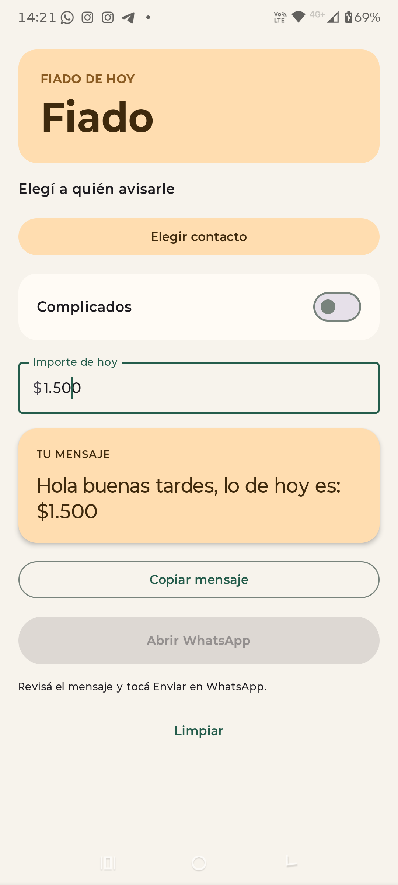
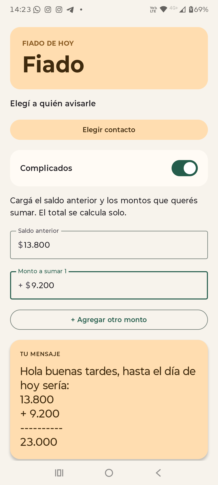
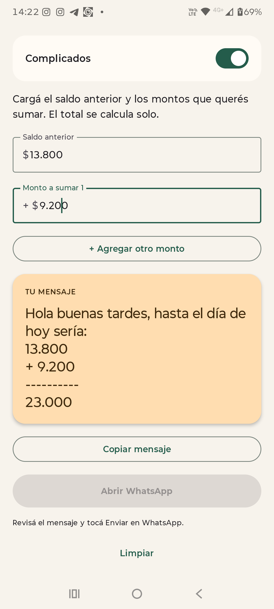

# Fiado

### Del importe al mensaje, en unos pocos toques.

Prepará el cobro de hoy, sumá lo pendiente y abrí WhatsApp con el texto listo.

[**📲 Descargar Fiado para Android**](https://github.com/DiegoMiotti/fiado-app/releases/download/v0.2.1/Fiado-0.2.1-debug.apk)

**Android 15 o superior · Pesos enteros · Sin crear una cuenta**

## Por qué hice Fiado

Creé Fiado para **aprender desarrollo Android y ayudar a mi padre con las cuentas de su negocio**. Él anota los fiados en un papel y después envía los importes a cada cliente por WhatsApp.

Elegí simplificar ese método que ya conoce: cargar los montos, calcular el total y preparar el mensaje. Así conserva sus anotaciones y ahorra mucho tiempo al comunicar los cobros. **Aprender resolviendo una necesidad real de mi familia es el motivo de esta app.**

## Así se ve

| Cobro de hoy | Suma detallada | Mensaje listo |
|:---:|:---:|:---:|
|  |  |  |

Capturas reales con importes ficticios, sin nombres ni teléfonos.

## Cómo funciona

1. **Cargá el importe de hoy** o activá **Complicados** para sumar un saldo anterior y nuevos montos.
2. **Revisá la vista previa** y elegí un contacto si vas a usar WhatsApp.
3. **Copiá el mensaje o abrí WhatsApp.** Vos comprobás el destinatario y confirmás el envío allí.

La normalización de teléfonos está orientada a **celulares del área 11 de Argentina**. Fiado no envía mensajes automáticamente ni guarda un historial de deudas: tus anotaciones siguen siendo el registro.

## Instalación

Descargá el APK, abrilo en tu teléfono y permití la instalación desde la app utilizada si Android lo solicita. Es una **versión de prueba**, fuera de Google Play. Mientras el repositorio sea privado, necesitás acceso para descargarla.

Hecha con **Kotlin y Jetpack Compose**. [Validación y pendientes](VALIDACION.md) · [Notas de la versión](https://github.com/DiegoMiotti/fiado-app/releases/tag/v0.2.1) · [Reportar un problema](https://github.com/DiegoMiotti/fiado-app/issues).
